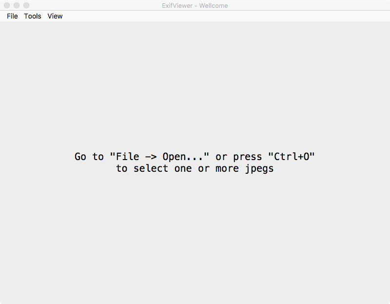
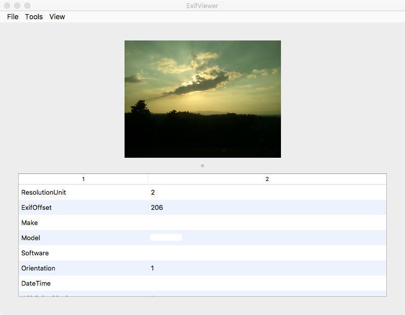
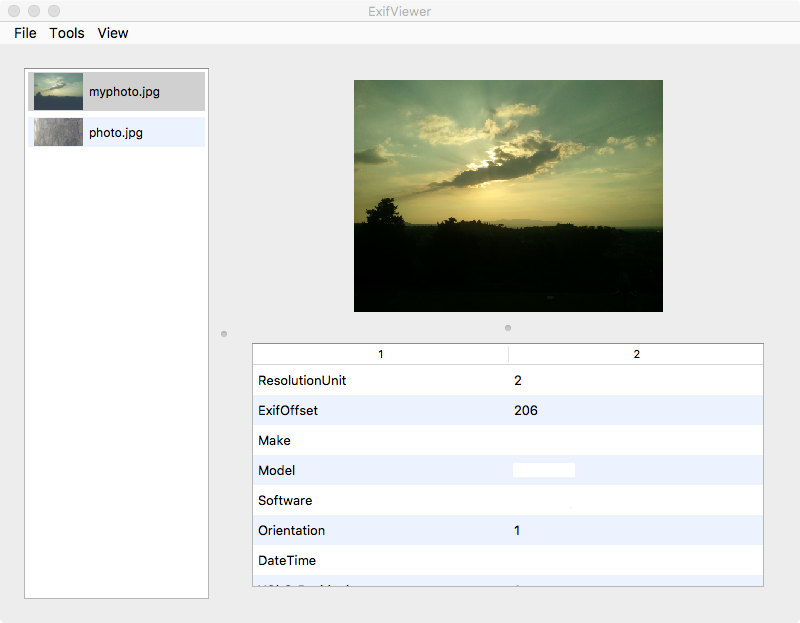
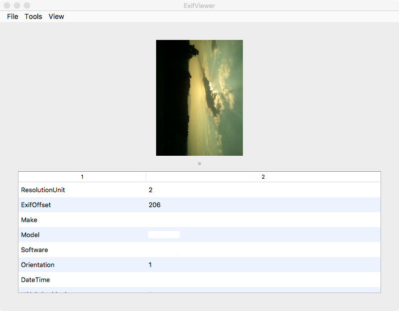

# Exif Viewer

Python exif viewer application for jpeg images. This is an academic exercise from a course at Università degli Studi di Firenze.


## Prerequisites

Package | Version
------- | -------
[Python](https://www.python.org) | 3
[PyQt](https://www.riverbankcomputing.com/software/pyqt/download5) | 5.10
[Pillow](http://pillow.readthedocs.io/en/latest/index.html) | 5.0.0

## Running the application

From the project's directory run the python main file:
```
python3 main.py
```

## Using the application

From the starting window a message is displayed to help you load the images. To load an image there are two possible ways:
* Use the **hotkey** "Crtl+O" or "⌘O" depending on your system.
* **Go to** "File -> Open..."

In the file dialog that appears you can choose one or more jpegs.

The **side list** can be used to navigate through the loaded images or can be hidden from the "View" menu.

Viewed images can be **rotated** clockwise and counterclockwise through the "Tools" or by pressing "Ctrl+R" and "Ctrl+L" respectively.

Currently viewed images can be **removed** from the "File" menu or by pressing "Ctrl+W".

## Keyboard Shortcuts
Functionality | Combination
------- | -------
Load new image | `Ctrl+O`
Remove current image | `Ctrl+W`
Show/Hide side list | `Ctrl+M`
Rotate Left | `Ctrl+Left Arrow`
Rotate Right | `Ctrl+Right Arrow`

For Mac Os users use `cmd` key instead of `Ctrl`.

## Preview

### Starting window

### Viewing images

### Side list

### Rotate images

